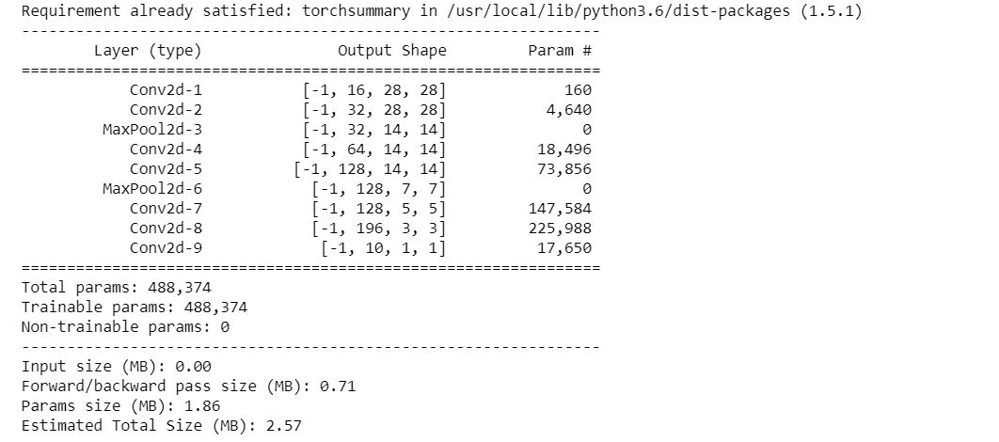
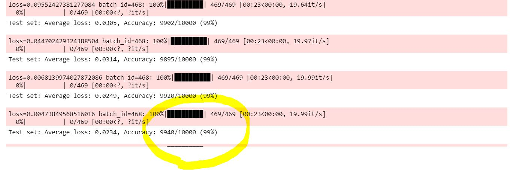

# S4
##CV Assignment on Architectural Basics

###The main objective of this learning assignment is to design a network to classify the digit images from the MNIST dataset with the following requirements:

1.99.4% validation accuracy.

2.Less than 20k Parameters.

3.Experimentation is allowed.

4.Less than 20 Epochs.

5.No fully connected layer.

6.Code for reference: https://www.kaggle.com/enwei26/mnist-digits-pytorch-cnn-99 .

Constraints

Copying Architecture From above project is not allowed, this for reference and learning how to integrate things Like Dropout, Batchnorm, etc.

So the After lot of iteration and experiemnts our final Architecture is like shown in image.
We have not used fully connected layer and also dropout in our final version of network.
Keeping the Parameters constraint in mind we have adjusted the inout and output size.

As instructed our parameters are less than 20k.

As per the requirement we are getting the accuracy of 99.40 in one of the epochs.

