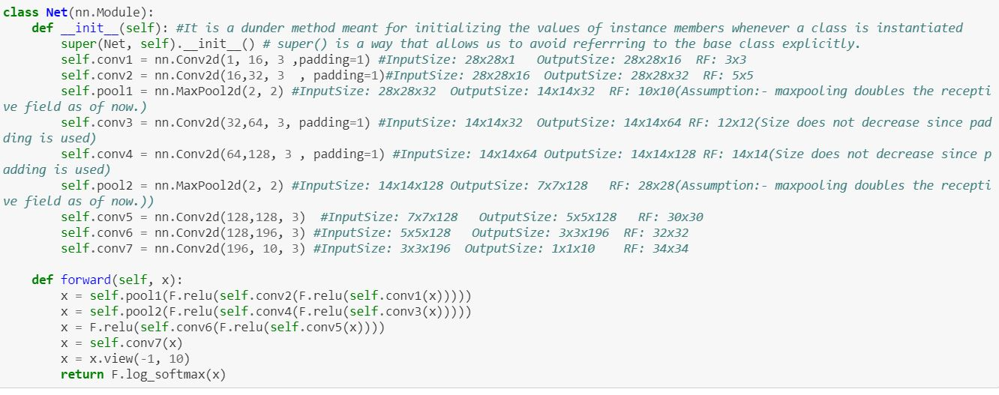

# S4
##CV Assignment on Architectural Basics

###The main objective of this learning assignment is to design a network to classify the digit images from the MNIST dataset with the following requirements:

1.99.4% validation accuracy.

2.Less than 20k Parameters.

3.Experimentation is allowed.

4.Less than 20 Epochs.

5.No fully connected layer.

6.Code for reference: https://www.kaggle.com/enwei26/mnist-digits-pytorch-cnn-99 .

Constraints

Copying Architecture From above project is not allowed, this for reference and learning how to integrate things Like Dropout, Batchnorm, etc.

